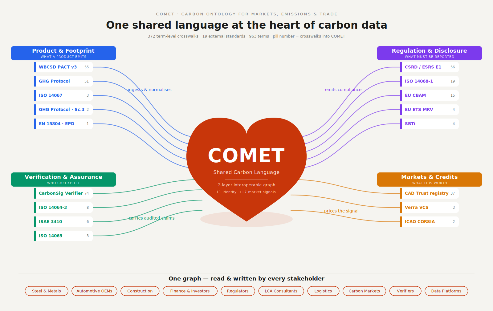

# COMET — Carbon Ontology for Markets, Emissions & Trade

A free, open, community-governed meta-ontology that maps product-level carbon
footprint data, supply chain verification, Environmental Attribute Certificates,
and market-pricing signals into a single interoperable knowledge graph. COMET
provides a shared language so carbon data can move between platforms, suppliers,
regulators, and markets without translation loss.

*The standards that produce carbon data all speak different dialects. COMET is
the shared language between them — and the single graph every stakeholder reads.*

## The Problem

Carbon data exists across platforms, suppliers, and regulators — but none speaks
the same language. Different units, methodologies, scopes, and emission factor
vintages make comparison, verification, and trading impossible. Without a common
schema, every integration is bespoke, every audit is manual, and every market
signal is noisy.

## Architecture

COMET is organised as a seven-layer stack:

| Layer | Name | Covers |
|-------|------|--------|
| L1 | Core Identity | Organisations, Sites, Processes, Materials, UOM |
| L2 | Emission Factors | Ecoinvent, WorldSteel, BAFU, Climatiq |
| L3 | Supply Chain & Activity Data | Bills of materials, transport, energy inputs |
| L4 | Product Carbon Footprint | ISO 14067, PACT v3 aligned PCFs |
| L5 | Environmental Attribute Certificates | I-RECs, DAC credits, GO certificates |
| L6 | Verification & Assurance | Third-party audits, chain-of-custody proofs |
| L7 | Market Signals | Carbon premiums, CBAM tariffs, EAC prices |

## Use Cases & Wins

COMET v0.3.0 makes a full carbon **verification engagement** machine-readable
end-to-end — from raw activity data to the verifier's signed opinion — across
the standards driving the ~$20B/yr (2025) carbon verification market. Concrete
wins enabled by the v0.3.0 release:

| # | Use case | What COMET now does | Standards exercised |
|---|----------|---------------------|---------------------|
| 1 | **Corporate inventory → disclosure** | Ingest a GHG Protocol / ESRS inventory (JSON or CSV) and emit Scope 1/2/3 (by category 1–15), base-year and intensity aggregates as one COMET document. `comet convert --from ghg-protocol` | GHG Protocol, CSRD/ESRS E1, ISSB S2, ISO 14064-1 |
| 2 | **Verifier-in-the-loop** | Model the complete verification deliverable: opinion type (unqualified/qualified/adverse/disclaimer), materiality threshold, findings log, corrective-action requests with severity & lifecycle, accreditation body, site-visit record, independence declaration | ISO 14064-3, ISAE 3410, ISO 14065 |
| 3 | **Clean-hydrogen tax credit** | Convert an IRA 45V attestation into COMET with the four statutory 26 USC 45V(b) credit tiers computed from 45VH2-GREET lifecycle carbon intensity, including USD/kg and estimated-credit value. `comet convert --from 45v` | IRA 45V |
| 4 | **Border-carbon exposure** | Carry CBAM embedded emissions + shadow-tariff signal alongside the product footprint, so import exposure is computed from the same graph as the PCF | EU CBAM, ISO 14067 |
| 5 | **Aviation offsetting** | Tag emission units as CORSIA-eligible with phase/vintage eligibility windows | ICAO CORSIA |
| 6 | **Credit provenance & integrity** | Validate credit records (Verra VCS / Gold Standard) with validation + verification metadata and corrective-action history wired in | Verra VCS, Gold Standard, Article 6 |

Every new term ships with **SHACL shapes** (validated with `pyshacl`) and a place
in the JSON Schemas, so instance data can be machine-checked, and a regenerated
[interactive Schema Map](https://nickgogerty.github.io/comet-ontology/schema-map.html)
+ [glossary](https://nickgogerty.github.io/comet-ontology/glossary.html) keep the
141 core terms and 293 standards-alignment crosswalks browsable. See
[CHANGELOG.md](CHANGELOG.md) for the full v0.3.0 entry.

## Documentation

- [Microsite](https://nickgogerty.github.io/comet-ontology/) — Project overview and documentation hub
- [Ontology Specification](https://nickgogerty.github.io/comet-ontology/ontology.html) — Complete 20-section specification
- [Master Build Plan](https://nickgogerty.github.io/comet-ontology/build-plan.html) — 200 steps across 10 expert panels
- Stakeholder Deck (PPTX) — in `docs/` folder

## Related Research — Carbon at Risk

COMET builds on the [Carbon at Risk (CaR)](https://www.carbonatrisk.org/) framework,
originated by Nick Gogerty at Carbon Finance Labs. CaR applies Value-at-Risk
methodology to carbon removal, quantifying delivery risk and storage risk across
removal approaches. Where CaR provides the risk measurement language, COMET
provides the ontological infrastructure to make it interoperable.

## Standards Alignment

ISO 14064-1/-3, ISO 14065, ISO 14067, ISO 14068-1, PACT v3, EU CBAM,
CSRD/ESRS E1, ISSB S2, GHG Protocol (Scope 1/2/3), EN 15804, ISAE 3410/3000,
IRA 45V, ICAO CORSIA, SBTi, Verra VCS, Gold Standard, Article 6, CAD Trust,
ResponsibleSteel, ASI — 293 term-level crosswalks (see the
[alignments view](https://nickgogerty.github.io/comet-ontology/schema-map.html)).

## License

CC BY 4.0 (content) | Apache 2.0 (code)

## About

A [Carbon Finance Lab](https://carbonfinancelab.com) research initiative.
